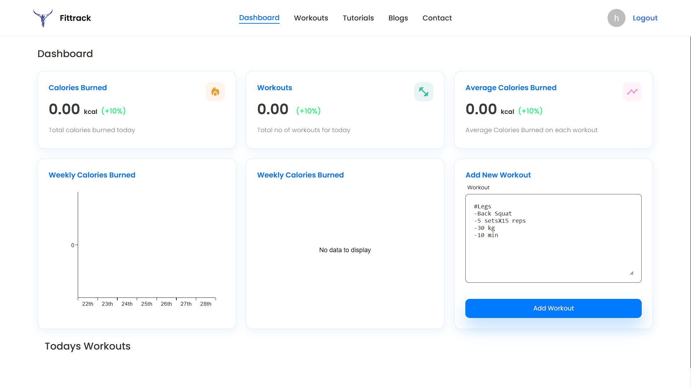
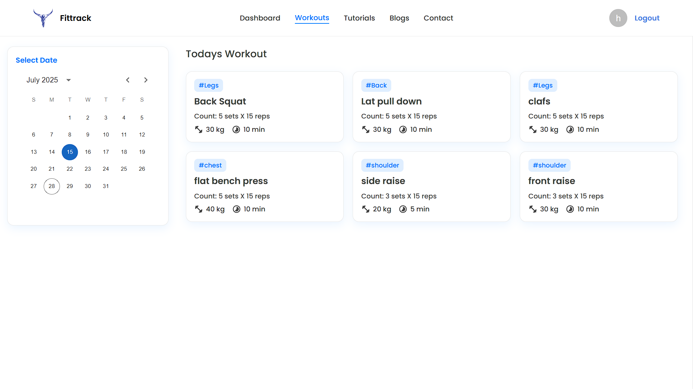

# Fittrack

Fittrack is a full-stack fitness tracking application that allows users to log workouts, track calories burned, and visualize their progress. The project consists of a React client and a Node.js/Express server with MongoDB.

---

## Deployment

Fittrack is live!  
Access the deployed application here: [https://fitnnesstrack.netlify.app/](https://fitnnesstrack.netlify.app/)

---

## Features

- User authentication (Sign Up, Sign In)
- Dashboard with daily and weekly stats
- Add and view workouts by date
- Visual charts for calories burned and workout categories
- Persistent login using Redux and redux-persist
- **Workout History:** View and filter all past workouts by type, date, or duration
- **Goal Setting:** Set fitness goals and track progress
- **Reminders & Notifications:** Get reminders for scheduled workouts or inactivity
- **Social Sharing:** Share achievements or workout summaries on social media
- **Exercise Library:** Browse and add exercises from a curated library
- **Progress Photos:** Upload and compare progress photos over time
- **Dark Mode:** Toggle between light and dark themes
- **Mobile Responsiveness:** Fully responsive design for mobile and tablet devices
- **Export Data:** Download workout and progress data as CSV or PDF
- **Integration with Wearables:** Sync data from fitness trackers via APIs

---

## Screenshots




---

## Project Structure

```
Fittrack/
├── client/         # React frontend
│   ├── src/
│   │   ├── api/    # API calls using axios
│   │   ├── components/
│   │   ├── pages/
│   │   ├── redux/
│   │   ├── utils/
│   │   └── App.js
│   ├── public/
│   └── package.json
├── server/         # Express backend
│   ├── controllers/
│   ├── middleware/
│   ├── models/
│   ├── routes/
│   ├── index.js
│   ├── error.js
│   └── package.json
└── .gitignore
```

---

## Getting Started

### Prerequisites

- Node.js
- npm
- MongoDB database (local or cloud)

### Installation

1. Clone the repository:
   ```sh
   git clone https://github.com/yourusername/fittrack.git
   cd fittrack
   ```

2. Install server dependencies:
   ```sh
   cd server
   npm install
   ```

3. Install client dependencies:
   ```sh
   cd ../client
   npm install
   ```

4. Set up environment variables for the server:
   - Create a `.env` file in the `server` folder with:
     ```
     MONGO_URI=your_mongodb_connection_string
     JWT=your_jwt_secret
     ```

### Running the Application

1. Start the server:
   ```sh
   cd server
   npm start
   ```

2. Start the client:
   ```sh
   cd ../client
   npm start
   ```

3. Open [http://localhost:3000](http://localhost:3000) in your browser.

---

## API Endpoints

See [server/routes/User.js](server/routes/User.js) for all user-related endpoints:
- `POST /api/user/signup` – Register a new user
- `POST /api/user/signin` – Login
- `GET /api/user/dashboard` – Get dashboard stats (auth required)
- `GET /api/user/workout` – Get workouts by date (auth required)
- `POST /api/user/workout` – Add new workout (auth required)

---

## Environment Variables

- `MONGO_URI`: MongoDB connection string
- `JWT`: Secret key for JWT authentication

---

## Testing Instructions

To run unit and integration tests:

```sh
cd server
npm test

cd ../client
npm test
```

---


## Contact

For support or feedback, email [harsh531970@gmail.com](mailto:harsh531970@gmail.com).

---

## Credits

- [React](https://react.dev/)
- [Express](https://expressjs.com/)
- [MongoDB](https://mongodb.com/)
- [Material UI](https://mui.com/)
- [Redux](https://redux.js.org/)
- All contributors

---

